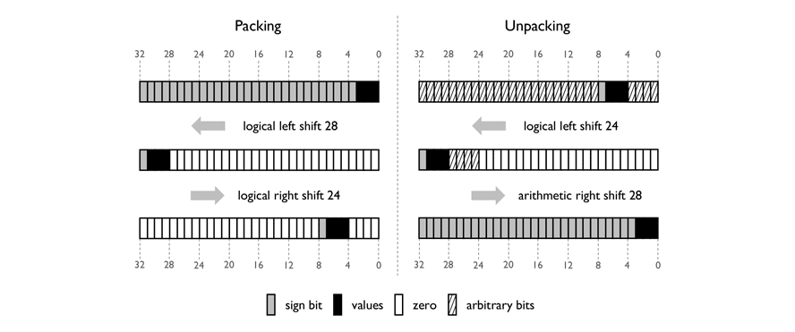
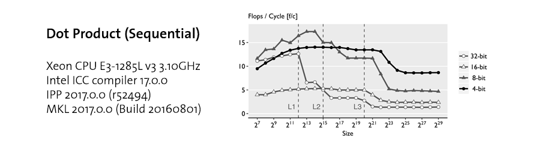
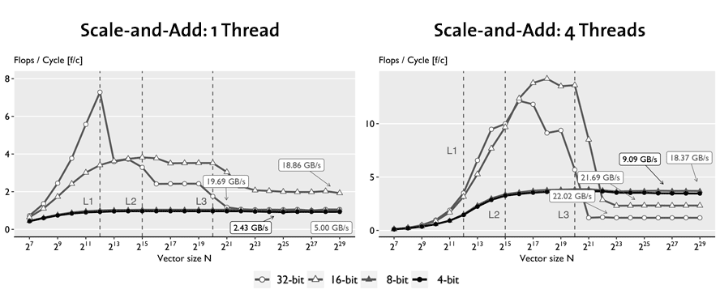
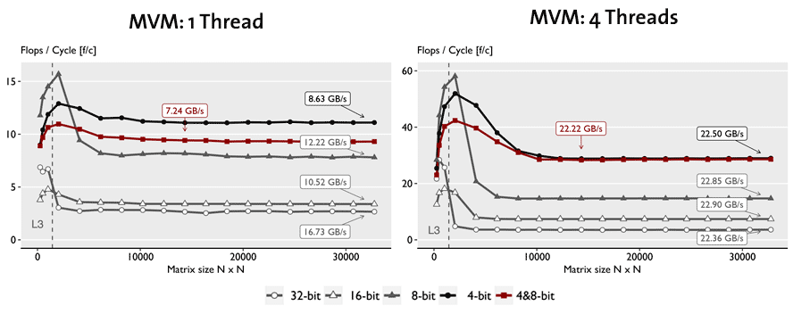

<br />

[Clover](https://github.com/astojanov/Clover) is a new library for the efficient computation on low-precision data, providing
mathematical routines required by fundamental methods in optimization and sparse recovery. Our library faithfully implements
variants of stochastic quantization and supports 4-bit quantized and 8-bit quantized data formats and demonstrate that 4-bit
can be implemented efficiently using Intel `AVX2` despite the lack of native support for this data format.

<br />

[Clover](https://github.com/astojanov/Clover) also supports 16-bit half precision and 32-bit single precision IEEE-754 formats
that are natively supported by Intel processors. Experimental results with dot product, matrix-vector multiplication,
gradient descent (GD), and iterative hard thresholding (IHT) illustrate the attainable speedups, in many cases close to linear
in the reduction of precision because of reduced data movement.

<br />

This library is implemented in collaboration with [Tyler Michael Smith](https://github.com/tlrmchlsmth)
as a research project at [Department of Computer Science at ETH Zurich](https://www.inf.ethz.ch/),
supervised by [Dan Alistarh](https://people.csail.mit.edu/alistarh/) and [Markus Püschel](https://www.inf.ethz.ch/personal/markusp/).
The work is published at [SIPS 2018](http://sites.ieee.org/sips2018/) and detailed overview of the Clover library can be found
in the pre-printe available [here](/publications/preprint/005_sips18-sclover.pdf).


<br />


Clover Data Structure
---------------------

Quantization is a lossy compression technique that maps continuous values to
a finite set of fixed bit-width numbers. For a given vector $$v$$ of size $$n$$ and precision of $$b$$ bits,
we first derive a factor $$s_v$$ that scales the vector elements $$v_i$$ into the representable range:

<p>
$$ s_v = \frac{2^{b-1} - 1}{\max_{i \in [1, n]} |v_i|}. $$
</p>

The scaled $$v_i$$ are then quantized stochastically:

<p>
$$ v_i \rightarrow \left\lfloor v_i \cdot s_v + \mu \right\rfloor  $$
</p>

where $$\mu$$ is drawn uniformly from the interval $$(0,1)$$. With this, a quantized array consists of one scaling factor and an array of quantized $$b$$-bit values.

<br />

Functionality for quantized 4-bit linear algebra operations is provided by the `CloverVector4` and `CloverMatrix4` containers. `CloverVector4`
contains a vector represented in a quantized 4-bit format. The values and the scaling factors are stored in separate contiguous blocks of memory,
such that sub-vectors of length 64 share the same scale.

<br />


<br />

An illustration of the memory layout of a `CloverVector4` container is shown above. Each value in the vector is stored as a
two’s complement in a 4-bit [nibble](https://en.wikipedia.org/wiki/Nibble). The x86 architecture uses byte addressing,
so we address each the nibbles in software. We accomplish this explicitly in the application logic, storing two consecutive
nibbles in a byte. As a result, the values in a `CloverVector4` of length n are represented as an array of n/2 bytes.
`CloverVector8` shares the same design principles. `CloverVector16` and `CloverVector32` containers do not have scales,
and the data layout is not organized into blocks. A simplified illustration of the `CloverVector4` container is shown below:

```cpp
class CloverVector4 {
  protected:
    uint64_t length;
    int8_t * values;
    float  * scales;
}
```

The 4-bit values stored in the `values` array are
in the range of $$\left[-7, 7 \right]$$, therefore each element at position `pos` is obtained by multiplying the value with the
corresponding scale, and dividing the result by `7.0f`. An illustration of a `get` procedure is given with:

```cpp
inline float get(uint64_t pos) const
{
    const uint64_t idx   = pos >> 1;
    const uint64_t block = pos >> 6;

    const float scale = scales[block] / 7.0f;
    const int8_t qu_p = values[idx];

    return scale * (float) _mm_srai_epi8_ss(qu_p << (pos % 2) * 4, 4);
}
```

where `_mm_srai_epi8_ss` performs 8-bit right shifts while extending in sign bits.

<br />


Fast Packing and Unpacking of 4-bit values
--------------------------

The x86 architecture does not support 4-bit integer arithmetic.
Thus we *unpack* the values, representing them as larger (i.e., 8, 16 or 32-bit) integers for computation.
Then, for efficient storage and data movement, we *pack* these larger integers,
representing them as 4-bit integers stored within a larger entity.

<br />

The goal of unpacking from a 32-bit integer (right part of figure below) is as follows:
We start with a 32-bit entity that stores multiple nibbles inside of it.
We wish to extract a single 4-bit nibble and represent it as a 32-bit integer.
This can be done with two bit shifts:

<br />

(1) a logical left shift is used to shift the nibble so that it occupies the highest-order 4-bits of the 32-bit entity.
(2) an arithmetic right shift is used to shift the nibble to the lowest order 4-bits of the 32-bit entity.

<br />

The arithmetic right shift has sign extension, filling the high-order 28 bits with the sign bit of the nibble.
yielding a 32-bit integer with the same value as the two's complement 4-bit value.


<br />

<br />

<br />

The goal of packing (left part of figure above) is to revert the unpacking operation.
Two bit shifts can be used to place the lowest order 4 bits of a 32-bit integer anywhere within a 32-bit entity.

<br />

(1) a logical left shift is used to shift the nibble so that it occupies the highest-order 4-bits of the 32-bit entity.
(2) a logical right shift is used to shift the nibble to somewhere within the 32-bit entity.

<br />

The first sets the bits lower-ordered than the nibble to zero,
and the second sets the bits higher-ordered than the nibble to zero.
A bitwise `OR` operation can then be used to store up to eight nibbles in the 32-bit entity.

<br />

Dot Product in Clover
---------------------

Taking in consideration the fast packing and unpacking, as well as the structure of the
`Clover` containers, let's illustrate how we can write a fast dot product routine using
`AVX2`. Let's assume that we like to perform dot product on two vectors `U` and `V`.

<br />

We denote the values of the `U` vector with the following variables:

```cpp
const int8_t * u = ... ; // the array of 4-bit quantized values
const float * su = ... ; // the array of 32-bit floating point scales
```

And the vector `V` with:

```cpp
const int8_t * v = ... ; // the array of 4-bit quantized values
const float * sv = ... ; // the array of 32-bit floating point scales
```

Now, let's setup the constants and initialize the accumulator for the result variable:

```cpp
// we initialize the accumulator to 0
__m256 dot_product_acc  = _mm256_setzero_ps();

// we setup the constants that are going to be used later
const __m256  clover_mm256_rcp_49_ps        = _mm256_set1_ps(1.0f / 49.0f);
const __m256i clover_mm256_1st_bit_set_epi8 = _mm256_set1_epi8  (-16);
const __m256i clover_mm256_1_epi16          = _mm256_set1_epi16(1);
```

Since values are stored in blocks of 64 elements, we will traverse each block using iterator `i`, loading
quantized values of 4-bits and their corresponding block scales:

```cpp
offset = i * 64 / 2;

// Load two quantized values
const __m256i qu = _mm256_loadu_si256( (__m256i *) (u + offset) );
const __m256i qv = _mm256_loadu_si256( (__m256i *) (v + offset) );

// Load the scales by boradcasting them into an AVX register
const __m256 su = _mm256_broadcast_ss(su + i);
const __m256 sv = _mm256_broadcast_ss(sv + i);
```

Now once we have the scales, we can multiply them and divide them by 49. As division is expensive,
we calculate the reciprocal value of 49 into `clover_mm256_rcp_49_ps` and perform multiplication
instead:

```cpp
const __m256 su_scaled  = _mm256_mul_ps(su, clover_mm256_rcp_49_ps);
const __m256 scaled_rcp = _mm256_mul_ps(su_scaled, sv);
```

While these multiplications happen, we cna always instruct the prefetcher to start moving data
from RAM into the cache hierarchy from both vectors:

```cpp
_mm_prefetch((char *)(u + offset + 64), _MM_HINT_T0);
_mm_prefetch((char *)(v + offset + 64), _MM_HINT_T0);
```

Once we have loaded the 4-bit values, we obtained 64 values into a single register. As we
can not operate with 4-bits natively, we will operate such that we convert the 4-bit values
into 8-bits. Assuming presence of 8-bit shifts, we can apply the fast packing/unpacking
method to extract the low bits and high bits at each 8-bit chunk. However, `AVX2` provides
us with 16-bit shifts only.

<br />

To deal with that, we shift by 4 bits left, and then we perform bitwise `AND` operations,
such that the high 4-bits of the 8-bit chunk is taken into consideration. To do that, we
use the previously defined mask in `clover_mm256_1st_bit_set_epi8`:

```cpp
const __m256i qu_lo_shift = _mm256_slli_epi16(qu, 4);
const __m256i qv_lo_shift = _mm256_slli_epi16(qv, 4);

const __m256i qu_hi = _mm256_and_si256(clover_mm256st_bit_set_epi8, qu);
const __m256i qv_hi = _mm256_and_si256(clover_mm256st_bit_set_epi8, qv);
const __m256i qu_lo = _mm256_and_si256(clover_mm256st_bit_set_epi8, qu_lo_shift);
const __m256i qv_lo = _mm256_and_si256(clover_mm256st_bit_set_epi8, qv_lo_shift);
```

At this point in time, we obtain 2 variables for `qu` and 2 variables for `qv` such that
each contain 32 elements of 4-bit. `qu_hi` represents the 4 high bits, and `qu_lo` represents
the low 4 bits. In each of these 4 variables, the 4-bits reside in the high 4-bit of the 8-bit
chunk i.e. they are all multiplied by $$2^4$$.

<br />

Now, we would like to multiply the corresponding high/low bits of the first vector with the
corresponding high/low bits of the second vector. Unfortunately `AVX2` does not provide us
with a vector instruction that can multiply signed 8-bit integers. Instead, it provide us with
the [vpmaddubsw](https://software.intel.com/sites/landingpage/IntrinsicsGuide/#text=_mm256_maddubs_epi16&expand=3284)
instruction that we can use to perform this computation:

```cpp
__m256i _mm256_maddubs_epi16 (__m256i a, __m256i b)
```

The definition of this instruction is given as: *Vertically multiply each unsigned 8-bit integer from a with the corresponding signed 8-bit
integer from b, producing intermediate signed 16-bit integers. Horizontally add adjacent
pairs of intermediate signed 16-bit integers, and pack the saturated results in dst.*

<br />

This means that we can perform multiplication and addition, obtaining 16-bit chunks as a result. However,
we need to make sure that left operand is unsigned and that the signed is accumlated in the right operator:

```cpp
// Get absolute values of u vectors
const __m256i au_hi = _mm256_sign_epi8(qu_hi, qu_hi);
const __m256i au_lo = _mm256_sign_epi8(qu_lo, qu_lo);

// Sign the values of the v vectors
const __m256i sv_hi = _mm256_sign_epi8(qv_hi, qu_hi);
const __m256i sv_lo = _mm256_sign_epi8(qv_lo, qu_lo);

// Perform multiplication and create 16-bit values
const __m256i dot_hi = _mm256_maddubs_epi16 (au_hi, sv_hi);
const __m256i dot_lo = _mm256_maddubs_epi16 (au_lo, sv_lo);
```

At this point, we have computed the multiplication of corresponding elements, and we have
added neighbouring elements, obtaining the result into 16-bit chunks. As the 8-bit chunks were already offsetted
by factor of $$ 2^4 $$, the 16-bit chunks contain values in the range of
$$ \left[-(2^4 \cdot 7)^2 \cdot 2,  (2^4 \cdot 7)^2 \cdot 2\right] $$, or $$ \left[-25088, 25088\right] $$.
To continue, we shift the values right, while extending in sign bits, effectively dividing the 16-bit chunks
by factor of $$ 2^8 $$ (making sure that the values are in the range $$ \left[-98, 98\right] $$):


```cpp
const __m256i dot_hi_shift = _mm256_srai_epi16 (dot_hi, 8);
const __m256i dot_lo_shift = _mm256_srai_epi16 (dot_lo, 8);
```

Now we can simply add the two 16-bit values using 16-bit addition provided by `AVX2`:

```cpp
const __m256i dot_16 = _mm256_add_epi16(dot_hi_shift, dot_lo_shift);
```

The final result of the dot product is a floating point numbers, therefore before we multiply
the result with the 32-bit float, we need to find some way to convert the 16-bit chunk into
a float. We can do this in a single instruction using [vpmaddwd](https://software.intel.com/sites/landingpage/IntrinsicsGuide/#text=_mm256_madd_epi16&expand=3256)
instruction.

```cpp
__m256i _mm256_madd_epi16 (__m256i a, __m256i b)
```

The definition of this instruction is given with: *Multiply packed signed 16-bit integers in
a and b, producing intermediate signed 32-bit integers. Horizontally add adjacent pairs of
intermediate 32-bit integers, and pack the results in dst.*

<br />

To use it, we define `clover_mm256_epi16` such that it is set to `1` in each 16-bit chunk:

```cpp
const __m256i dot_32 = _mm256_madd_epi16(clover_mm256_epi16, dot_16);
const __m256  dot_f  = _mm256_cvtepi32_ps(dot_32);
```

Finally, the last thing that we have to consider is multiplying the result, with the
corresponding scales, and accumulate it into the result. For that we can use `FMA`
instructions:

```cpp
dot_product_acc = _mm256_fmadd_ps(scaled_rcp, dot_f, dot_product_acc);
```

Once all blocks are iterated, the last step is to horizontally add the values into
the accumulator and return the result. A function that will get the job done is given
with:

```cpp
static inline float _mm256_haddf32_ps(__m256 acc)
{
    const __m128 left  = _mm256_extractf128_ps(acc, 1);
    const __m128 right = _mm256_castps256_ps128(acc);
    const __m128 x128  = _mm_add_ps(left, right);
    const __m128 x64   = _mm_add_ps(x128, _mm_movehl_ps(x128, x128));
    const __m128 x32   = _mm_add_ss(x64, _mm_shuffle_ps(x64, x64, 0x55));
    return  _mm_cvtss_f32(x32);
}
```

Clover Supported Routines
-------------------------

Each container implements the following routines:

|                   |   |         |
--------------------|---|---------|
| `.quantize`       | &nbsp;&nbsp;  | That converts 32-bit vector intro 4/8/16-bit quantized matrix. |
| `.restore`        | &nbsp;&nbsp;  | That converts the quantized vector into 32-bit matrix. |
| `.dot`            | &nbsp;&nbsp;  | Dot Product Routine. |
| `.scaleAndAdd`    | &nbsp;&nbsp;  | Scale and Add routine (equvalent to [AXPY](http://www.netlib.org/blas/))
| `.threshold(K)`   | &nbsp;&nbsp;  | Thresholding routine that drop all but the higest `K` elements in magnitude. |
|                   | &nbsp;&nbsp;  | |

The matrix container, namely `CloverMatrix4`, is represented similarly. The values and scales are stored as separate contiguous blocks of memory, both in row-major order. Sub-matrices of size 64 × 64 share the same scale. The length of each vector is padded to 128 elements, and the row and column size of the matrix is also padded to 128. Similar design decisions are made for `CloverMatrix8`. `CloverMatrix16` and `CloverMatrix32` do not contain scales. The following routines are available:


|             |   |         |
--------------|---|---------|
| `.quantize` | &nbsp;&nbsp;  | That converts 32-bit matrix intro 4/8/16-bit quantized matrix. |
| `.restore`  | &nbsp;&nbsp;  | That converts the quantized matrix into 32-bit matrix. |
| `.mvm`      | &nbsp;&nbsp;  | Matrix Vector Multiplication routine.|
| `.transpose`| &nbsp;&nbsp;  | Routine to transpose the matrix. |
|             | &nbsp;&nbsp;  | |


Each of these routines are implemented using SIMD code as much as possible. For each routine we provide scalar implementation having the same nomenclature, following `_scalar` for testing and validation purposes. When possible, we parallize the code using OpenMP and provide the same routines in threaded code folloging the `_parallel` suffix.

<br />

Performance Evaluation
----------------------

We evaluated our implementation on an [Intel Xeon CPU E3-1285L v3 3.10GHz](https://ark.intel.com/products/75466/Intel-Xeon-Processor-E3-1285L-v3-8M-Cache-3_10-GHz)
Haswell with 32GB of RAM and 25.6 GB/s bandwidth to main memory, running Debian GNU/Linux 8 (jessie),
kernel `3.16.43-2+deb8u3`. We use the Intel ICC compiler `17.0.0`, Intel IPP `2017.0.0 (r52494)`,
and Intel MKL `2017.0.0 (Build 20160801)`. We use `RDTSC` to measure the cycle count for each test,
performing 15 repetitions with warm cache, and using the median as a result. To avoid the effects
of frequency scaling and resource sharing on the measurements, Turbo Boost and Hyper-Threading are disabled.

<br />

For each routine we derive a pseudo flop count, using the number of additions and multiplications
required to perform the mathematical operations, and report our results in flops per cycle (F/C).
The flop count for dot product and scale and add is `2 * n` and for MVM it is `2 * n * n`.

<br />

**Dot Product.** The figure below shows the performance profile of the dot product. When the data fits in L1 and L2 cache the 32-bit version is much faster than 4-bit because the entire computation is done using native instructions without bit-unpacking. Once the data exceed L3 cache, 4-bit is fastest since the dot product is memory bound: data movement from RAM becomes the bottleneck. The speed-up is up to 6x over the 32-bit version.

<br />

<br />

**Scale and add.** Similar to the dot product, the plots below shows that the 32-bit and 16-bit implementations are faster than 4-bit and 8-bit within cache for the same reasons. However, even outside L3 cache, 4- and 8-bit are only able to match the 32-bit implementation due to the higher overhead. This is reflected in the low bandwidth used. As a result, parallelization yields near-linear speed-up for 4-bit and near none for 32-bit, making 4-bit about 3x faster.

<br />

<br />

**MVM.** In the figure below we compare our sequential and parallel implementations of MVM, respectively, for each datatype, including the mixed 4,8-bit MVM. For the sequential case, for problems that do not fit in cache, we see that pure 4-bit is about 4.6x faster than 32-bit but uses only one third of the available bandwidth, and the mixed 4-bit and 8-bit MVM is noticeable slower. However, once parallelized, all version exhaust the available bandwidth and thus reach a speedup linear in the precision reduction. The mixed 4,8-bit MVM is now as fast as the 4-bit version since the bottleneck is loading the matrix.

<br />

<br />