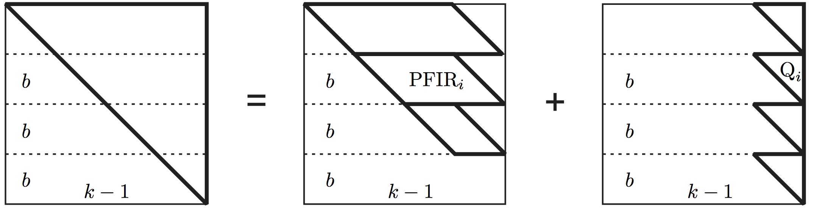
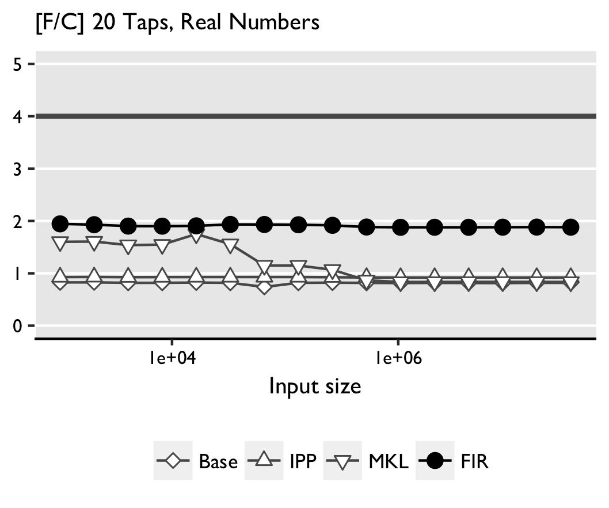
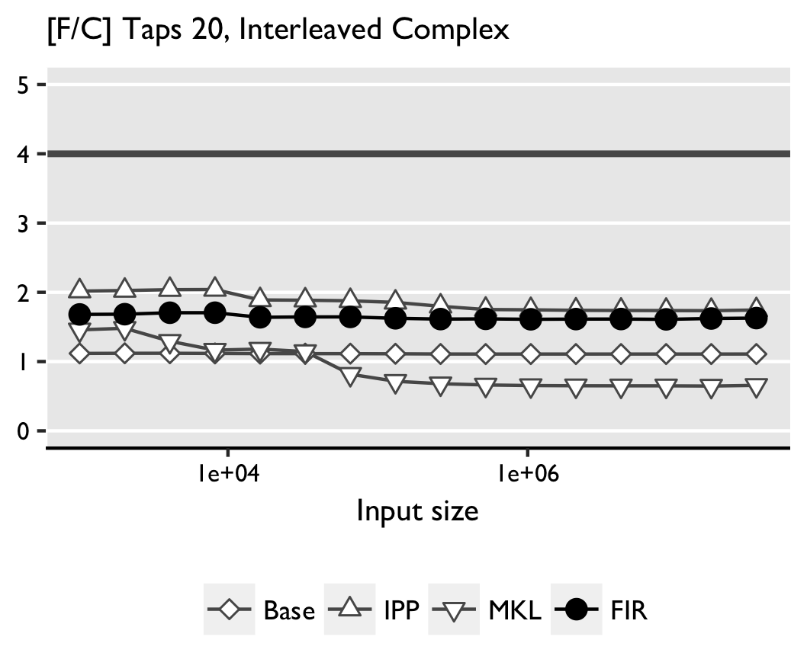

FGen is a program generator for performance-optimized functions implementing convolutions, or [FIR](https://en.wikipedia.org/wiki/Finite_impulse_response) filters.
The generator uses an internal mathematical DSL to enable structural optimization at a high level of abstraction.
We use FGen as a testbed to demonstrate how to provide modular and extensible support for modern SIMD (single instruction, multiple data) vector architectures in a DSL-based generator.


<br />
<div style="margin: auto; max-width: 500px">
    
</div>
<br />


<br />


Overview
--------

Convolution of two vectors `x` and `h`

$$x = (x_0, x_1, \ldots, x_{n-1})^T \text{ and } h = (h_0, h_1, \ldots, h_{k-1})^T$$

is given with the following formula:

$$
y_m = \sum_{i=0}^{k-1} x_{m+(k-1)-i} \cdot h_i,\quad m = 0, \ldots, n-1.
$$

We use the language of media processing and call `h` the filter, `k` the number of taps, and the computation finite-impulse-response filter (FIR).
The filter can also be viewed as a matrix vector product:

$$
y = x \ast h \Longleftrightarrow y = M_{n} (h) \cdot x,
$$

where `M_{n}(h)` is the `n * n` matrix:

$$
 \begin{bmatrix}
 h_{k-1} 	& h_{k-2} 	& \cdots 	& h_{0} 	& 			& 			\\
    		& \ddots	& \ddots	& \ddots	& \ddots	&  			\\
    		&			& h_{k-1}	& h_{k-2}	& \cdots	& h_{0}		\\
			& 			& 			& h_{k-1} 	& \cdots	& h_{1} 	\\
			& 			&			& 			& \ddots	& \vdots 	\\
			&			& 			& 		 	& 			& h_{k-1}	\\
\end{bmatrix}.
$$


In order to use the memory hierarchy, we could tile this matrix. The first observations is that the matrix can be broken down into two matrices.
One that has parallelogram shape matrix (PFIR), and another one that is an upper triangular matrix (UTFIR).
To express the breakdown formally, we use a mapping function, defined as:

$$
h^{n \rightarrow N}_{b}: i \mapsto b + i.
$$

and the notion of *gathers* and *scatters* defined in Figure 2 [here][fgenpaper]. Then the breakdown is defined as:

$$
x\ast h = S(h^{n-k+1 \rightarrow n}_{0}) \cdot x \parallel h   + S(h^{k-1 \rightarrow n}_{n-k+1}) \cdot \left[ G(h^{k-1 \rightarrow n}_{n - k + 1})\cdot x \bigtriangleup G(h^{k-1 \rightarrow k}_{1})\cdot h \right]
$$

Both PFIR and UTFIR can be tiled into smaller matrices. We can illustrate a the tiling of PFIR using:

<div style="margin: auto; max-width: 500px">
    
</div>
<br />

and similarly UTFIR:

<br />
<div style="margin: auto; max-width: 500px">
    
</div>
<br />

Formally, if $$ x \parallel h $$ represent a PFIR filter (prallelogram shape matrix), then:

$$
\begin{array}{rcl}
x \parallel h & = & \sum_{i=0}^{t^H-1} S(h^{b^H \rightarrow n-k+1}_{b^H \cdot i})  \sum_{j=0}^{t^V-1} (x_1 \parallel h_1) \\
	  	 & + & \sum_{i=0}^{t^H-1} S(h^{b^H \rightarrow n-k+1}_{b^H \cdot i}) (x_2 \parallel h_2 )  \\
		& + & S(h^{s^H \rightarrow n-k+1}_{b^Ht^H}) \sum_{j=0}^{t^V-1} (x_3 \parallel h_1)  \\
	  	& + & S(h^{s^H \rightarrow n-k+1}_{b^Ht^H})( x_4 \parallel h_2 )
\end{array}
$$

where

$$
\begin{array}{lcllcl}
	x_1 & = & G(h^{b^H + b^V-1 \rightarrow n}_{b^H \cdot i + b^V \cdot j}) \cdot x  & x_4  & = & G(h^{s^H + s^V - 1 \rightarrow n}_{b^Ht^H + b^Vt^V}) \cdot x	\\
	x_2 & = & G(h^{b^H + s^V-1 \rightarrow n}_{b^Vt^V + b^H \cdot i}) \cdot x	    & h_1  & = & G(h^{b^V \rightarrow k}_{k - b^V \cdot (j + 1)}) \cdot h	\\
	x_3 & = & G(h^{s^H + b^V - 1 \rightarrow n}_{b^Ht^H + b^V \cdot j}) 	\cdot x & h_2  & = & G(h^{s^V \rightarrow k}_{0}) \cdot h 		\\
\end{array}
$$

The breakdown of the UTFIR follows the similar formal expression that can be find [here][fgenpaper].

<br />

Loop optimizations
------------------


Loop optimizations such as loop merging, or loop unrolling are done at the $$\Sigma$$-LL level using a rewrite system
that fuses, for example data accesses. As one example,

$$
\sum_{i=0}^{p-1} S(h^{N_1 \rightarrow N}_{b}) \sum_{j=0}^{q-1}  S(h^{n \rightarrow N_1}_{b\prime})
$$

is rewritten into

$$
\sum_{i=0}^{p-1} \sum_{j=0}^{q-1}  S(h^{n \rightarrow N_1}_{b + b\prime}).
$$

<br />

Abstracting over Staging Decisions
----------------------------------

Once all high level optimizations are exhausted on the higher-level IR (Intermediate
Representation) of $$\Sigma$$-LL, we lower the high level IR into a `C`-like
IR that contains the low-level `C` code interleaved with vector instructions in the
form of `C`-intrinsics.

<br />

Note that the high-level $$\Sigma$$-LL IR deals with the pure mathematical
abstractions of the convolution expression and its tiling. However, this
abstract representation does not reason about the data type of the convolution
expression, its memory layout, memory allocation or how the math maps to
code or hardware instructions.

Therefore when lowering a high-level $$\Sigma$$-LL expression, we might
have to produce code that handles single or double precision floating point
numbers, or integral numbers. The code could be vectorized by SSE or AVX,
but could as well be a scalar code that handles left-over computations.
According to the $$\Sigma$$-LL transformations, a loop could be unrolled
or not. And finally the intput can be consisted from real numbers or
complex numbers, being interleaved or split in two memory locations. And
finally, the code that we need to generate might be staged code or
executed directly in the runtime.

<br />
<div style="margin: auto; max-width: 766px">
    
</div>
<br />

The figure above depicts the different possibilities that could be taken
to lower a high level $$\Sigma$$-LL expression.

<br />

**Represent Staging Decisions using Types** LMS uses the type system to
lift regular Scala code into staged code. To illustrate this process,
we can consider a simple `add` function:

```scala
def add (a: Int, b: Int) = {
  a + b
}
```

To stage the function we only need to replace `T` with `Rep[T]`:

```scala
def add (a: Rep[Int], b: Rep[Int]) = {
  a + b
}
```

Looking at the two functions, we can observe that both functions have
isomorphic bodies. This raises the question of whether it is possible
to use the type system in decode the decision on whether we stage this
function or not. Scala supports the definition of [type aliases](https://www.safaribooksonline.com/library/view/learning-scala/9781449368814/ch10.html)
which can be used to define identity type function:

```scala
type Idt[T] = T // We will  use NoRep[T] = T instead of Idt[T] = T for simplicity
```

Therefore, the initial non-staged `add` function could as well be written as:

```scala
def add (a: Idt[Int], b: Idt[Int]) = {
  a + b
}
```

This result with the simple consequence that the [higher kinded types](https://adriaanm.github.io/files/higher.pdf)
`Rep[_]` and `Idt[_]` can be used as decision of whether a given code
is staged or not. To abstract that decision we can use:

```scala
def add [R[_]] (a: R[Int], b: R[Int]) = {
  a + b
}
```

This allows us to plug `Rep[_]` and obtain staged function, or use `Idt[_]`
and deal with regular function.

<br />

**Representing Scalar or Vector Primitive Types** Scalar primitive types
are already represented in the type system of Scala (well at least the
signed types, as the JVM is missing unsigned types). However, neither Scala
nor the JVM has no notion for SIMD type primitives.

```scala
__m64   // MMX integer types
__m128  // SSE 4x32-bit float
__m128d // SSE 2x64-bit float
__m128i // SSE 2x64/4x32/8x16/16x8-bit integer
__m256  // AVX 8x32-bit float
__m256d // AVX 4x64-bit float
__m256i // AVX 4x64/84x32/16x16/32x8-bit integer
__m512  // AVX512 16x32-bit float
__m512d // AVX512 8x64-bit float
__m512i // AVX512 8x64/16x32/32x16/64x8-bit integer
```

Looking at the SIMD primitives however, we can notice that each of those
represent continious memory block of a given primitive. Therefore, we can
simply represent them with a generic type called `Packed[T]` such that
`T` corresponds to a given scalar primitive. Finally, using the identity
type explaned before, we can use the same trick to represent both the
SIMD and calar primitives:

```scala
type Single[T] = T
abstract Packed[T]
```

This allows us to abstract `Single[_]` and `Packed[_]`
using higher kinded types, as explained before.

<br />

**Abstracting Primitives**. So far we have defined the basis of representing
the scalar and the vector types. But to use them, we also need to define
the operations performed on the same types. We can do this using [type classes](https://blog.scalac.io/2017/04/19/typeclasses-in-scala.html)
inspired by `Numeric[T]` in Scala. Instead of `Numeric[T]` we define:

```scala
abstract class NumericOps[T:Manifest] {
  def plus       (x: T, y: T) : T
  def minus      (x: T, y: T) : T
  def times      (x: T, y: T) : T
  def interleave (x: T, y: T) : (T, T)
  def unravel    (x: T, y: T) : (T, T)

  class Ops(lhs: T) {
    def +(rhs: T) = plus (lhs, rhs)
    def -(rhs: T) = minus(lhs, rhs)
    def *(rhs: T) = times(lhs, rhs)
  }
  implicit def mkNumericOps(lhs: T): Ops = new Ops(lhs)
}
```

This allows us to easily define extension to the `NumericOps` class that
deals with non-staged code involving scalar primitives:

```scala
class NumericNoRepOps[T:Numeric:Manifest] extends NumericOps[NoRep[Single[T]]]  {
  def plus       (x : T, y : T) = implicitly[Numeric[T]].plus (x, y)
  def minus      (x : T, y : T) = implicitly[Numeric[T]].minus(x, y)
  def times      (x : T, y : T) = implicitly[Numeric[T]].times(x, y)
  def interleave (x : T, y : T) = (x, y)
  def unravel    (x : T, y : T) = (x, y)
  def fromDouble (x: Double): T = convert[Double, T](x)
}
```

... or staged scalars primitives:

```scala
class NumericRepOps[T:Numeric:Manifest] extends NumericOps[Rep[Single[T]]] {
  def plus       (x : Rep[T], y : Rep[T]) = numeric_plus [T](x, y)
  def minus      (x : Rep[T], y : Rep[T]) = numeric_minus[T](x, y)
  def times      (x : Rep[T], y : Rep[T]) = numeric_times[T](x, y)
  def interleave (x : Rep[T], y : Rep[T]) = (x, y)
  def unravel    (x : Rep[T], y : Rep[T]) = (x, y)
  def fromDouble (x: Double): Rep[T] = Const[T](convert[Double, T](x))
}
```

... or even vector operations:

```scala
class PackedNumericOps[T:Numeric:Manifest] extends NumericOps[Rep[Packed[T]]]  {
  private val vsize = codegen.getInstructionSetVectorSize[T]
  val m = implicitly[Manifest[T]]
  def plus       (x : Rep[Packed[T]], y : Rep[Packed[T]]) = infix_vadd[T](x, y)
  def minus      (x : Rep[Packed[T]], y : Rep[Packed[T]]) = infix_vsub[T](x, y)
  def times      (x : Rep[Packed[T]], y : Rep[Packed[T]]) = infix_vmul[T](x, y)
  def interleave (x : Rep[Packed[T]], y : Rep[Packed[T]]) = m.toString() match {
    case "Int" | "Float" => codegen.instructionSet match {
      case SSE | SSE2 | SSE3 | SSE3 | SSE41 | SSE42 | AVX => {
        val inm1 = (2 << 6) + (0 << 4) + (2 << 2) + (0 << 0)
        val inm2 = (3 << 6) + (1 << 4) + (3 << 2) + (1 << 0)
        (infix_shuffle[T](x, y, inm1), infix_shuffle[T](x, y, inm2))
      }
    }
    case "Double" => codegen.instructionSet match {
      case SSE2 | SSE3 | SSE3 | SSE41 | SSE42 | AVX =>
        (infix_unpack_low[T](x, y), infix_unpack_high[T](x, y))
    }
  }
  def unravel(x : Rep[Packed[T]], y : Rep[Packed[T]]) = m.toString() match {
    case "Int" | "Float" => codegen.instructionSet match {
      case SSE | SSE2 | SSE3 | SSE3 | SSE41 | SSE42 | AVX =>
        (infix_unpack_low[T](x, y), infix_unpack_high[T](x, y))
    }
    case "Double" => codegen.instructionSet match {
      case SSE2 | SSE3 | SSE3 | SSE41 | SSE42 | AVX =>
        (infix_unpack_low[T](x, y), infix_unpack_high[T](x, y))
    }
  }
}

```

The 3 classes above are the basis for the rest of our further implementation.

<br />

**Abstracting Complex/Real elements** Since
our requirements demands us to reason about complex or real numbers, we
abstract the two options using;

```scala
abstract class Element [+T] {}
case class Real    [+T] (_re: T)         extends Element[T] {}
case class Complex [+T] (_re: T, _im: T) extends Element[T] {}
```

And similarly to the abstraction defined for `NumericOps` we abstract on
top of the `Element` class:

```scala
abstract class ElementOps[ElementClass[_], T: NumericOps]
    (implicit m: Manifest[ElementClass[T]]) { self =>

  def plus    (x: ElementClass[T], y: ElementClass[T]): ElementClass[T]
  def minus   (x: ElementClass[T], y: ElementClass[T]): ElementClass[T]
  def times   (x: ElementClass[T], y: ElementClass[T]): ElementClass[T]

  class Ops(lhs: ElementClass[T]) {
    def +(rhs: ElementClass[T]) = plus (lhs, rhs)
    def -(rhs: ElementClass[T]) = minus(lhs, rhs)
    def *(rhs: ElementClass[T]) = times(lhs, rhs)
  }
  implicit def mkElementOps(lhs: ElementClass[T]): Ops = new Ops(lhs)
}
```

You will notice that the `ElementOps` abstraction expects the `ElementClass`
to have `T` as an underlying type, and has the `NumericOps` as an implicit
case class parameter. Similarly to `Numeric` in Scala, we can use this class
to generalize the computations:

```scala
class ComplexOps[T:Manifest](implicit nops: NumericOps[T]) extends ElementOps[Complex, T] { import nops._
  def plus  (x: Complex[T], y: Complex[T]) = Complex(x._re + y._re, x._im + y._im)
  def minus (x: Complex[T], y: Complex[T]) = Complex(x._re - y._re, x._im - y._im)
  def times (x: Complex[T], y: Complex[T]) = {
    val m1 = x._re * y._re
    val m2 = x._im * y._im
    val m3 = x._re * y._im
    val m4 = x._im * y._re
    Complex(m1 - m2, m3 + m4)
  }
  def extract (elem: Complex[T]) = List(elem._re, elem._im)
}
```

We can observe that the complex abstraction does not have to reason whether
the underlying primitives are of a particular type, or whether are vectorized
or not. It will simply use the `NumericOps` class to do the job. The abstraction
that represents the real numbers is implemented similarly.

<br />

**Abstracting Memory Layout** To achieve this, we need to abstract through
the operations performed on a given array. Therefore:

```scala
/**
 * @tparam V Staged array or not
 * @tparam R Element staged or not
 * @tparam P Packed or single
 * @tparam A Staged/non-staged and/or packed/single elements
 * @tparam T Primitives type
 */
abstract class ArrayOps[V[_], R[_], P[_], A[_], T] {
  def alloc  (s: V[Int]): V[Array[A[T]]]
  def apply  (x: V[Array[A[T]]], i: V[Int]): R[P[T]]
  def update (x: V[Array[A[T]]], i: V[Int], y: R[P[T]])
}
```

This allows us to define several arrays of different structure, the first
being just staged array:

```scala
class StagedSingleArrayOps[T:Manifest] extends ArrayOps[Rep, Rep, Single, NoRep, T] {
  def alloc (s: Rep[Int]): Rep[Array[T]] = array_obj_new[T](s)
  def apply (x: Rep[Array[T]], i: Rep[Int]): Rep[T] = array_apply[T](x,i)
  def update(x: Rep[Array[T]], i: Rep[Int], y: Rep[T]) = array_update[T](x,i,y)
}
```

... we can as well define an array of staged scalar elements:

```scala
class ScalarSingleArrayOps[T:Manifest] extends ArrayOps[NoRep, Rep, Single, Rep, T] {
  def alloc (s: NoRep[Int]): Array[Rep[T]] = new Array[Rep[T]](s)
  def apply (x: Array[Rep[T]], i: NoRep[Int]): Rep[T] = x(i)
  def update(x: Array[Rep[T]], i: NoRep[Int], y: Rep[T]) = x.update(i,y)
}
```

... or a staged vector array (i.e. each load results with a vector type, and each
store is done with a vector type):

```scala
class StagedPackedArrayOps[T:Manifest] extends ArrayOps[Rep, Rep, Packed, NoRep, T] {
  val vecLength = codegen.getInstructionSetVectorSize[T]
  def alloc (s: Rep[Int]): Rep[Array[T]] = array_obj_new(s)
  def apply (x: Rep[Array[T]], i: Rep[Int]): Rep[Packed[T]] = infix_vload[T](x, i, vecLength)
  def update(x: Rep[Array[T]], i: Rep[Int], y: Rep[Packed[T]]) = infix_vstore(x, i, y)
}
```


**Putting it all Together** Finally, once we have all pieces of the abstraction
we are able to build one single vector abstraction that is able to abstract
all requirements:

```scala
abstract class CVector[V[_], E[_], R[_], P[_], T] (implicit
  val aops: ArrayOps[V, R, P, E, T]
  val eops: ElementOps[E, R[P[T]]],
  val nops: NumericOps[R[P[T]]],
) { self =>
  def apply  (i: V[Int]): E[R[P[T]]]
  def update (i: V[Int], y: E[R[P[T]]])
  def size   (): V[Int]
}
```

We call the abstraction `CVector`, as we generate `C` code, and our goal
is to represent a `C` vector structure with different instatiations.
Finally, if we want to use this function to simply perform additions,
we write the following code:

```scala
def add[V[_], E[_], R[_], P[_], T] (
    x: CVector[V, E, R, P, T],
    y: CVector[V, E, R, P, T],
    z: CVector[V, E, R, P, T]
) = for ( i <- 0 until x.size() ) {
  z(i) = x(i) + y(i)
}
```

Depending on the type instatiation, the same code can end up having
many different forms, as illustrated in Figure 4 taken from
[Abstracting Vector Architectures in Library Generators: Case Study Convolution Filters](http://spiral.ece.cmu.edu:8080/pub-spiral/pubfile/paper_179.pdf):

<br />
<div style="margin: auto; max-width: 766px">
    
</div>
<br />

While performing a sum is quite straight forward, the real power of this
abstraction is once performing the lowering step of $$\Sigma$$-LL into
`C`-IR.

```scala
class SigmaLL2IIRTranslator[E[_], R[_], P[_], T] {
  type Element = E[R[P[T]]]
  def sum (in: List[Element]) =
    if (in.length == 1) in(0) else {
      val (m, e) = (in.length / 2, in.length)
      sum(in.slice(0, m)) + sum(in.slice(m, e))
    }
  def translate(stm: Stm) = stm match {
    case TP(y, PFIR(x, h)) =>
      val xV = List.tabulate(k)(i => x.apply(i))
      val hV = List.tabulate(k)
               (i => h.vset1(h.apply(k-i-1)))
      val tV = (xV, hV).zipped map (_*_)
      y.update(y(0), sum(tV))
  }
}
```

In fact, the single codebase defined above, is capable or generating code
that is AVX, SSE or scalar code, that operates with real or complex
numbers, having loop or unrolled code, performing the computation using
floats, doubles or integers.

<br />

Results
-------

We benchmarked on two machines, Intel(R) Xeon(R) CPU E5-2643 3.3 GHz
supporting AVX, running Ubuntu 13.10, `kernel v3.11.0-12-generic`, and
Intel(R) Core(TM)2 Duo CPU L7500 1.6GHz supporting SSSE3, running
Debian 7, `kernel v3.2.0-4-686-pae`. Intel's Hyper-Threading,
Turbo Boost (Xeon) and Intel Dynamic Acceleration (Core2) were disabled
on both machines during the tests. We compare against convolutions
from Intel IPP v8.0.1 and Intel MKL v11.1.1.

<br />

As base line we also include a straightforward implementation of
convolution: a double loop with fixed array sizes. All code is compiled
using the Intel C++ Composer 2013.SP1.1.106, with flags `-std=c99 -O3 -xHost`.

<br />

We only consider double precision code (4-way on AVX and 2-way on SSSE3).
The input sizes, related to the input vector of the convolution expression,
are powers of two in the form of $$n = 512 \cdot 2^i$$ for $$i = 1, \ldots, 16$$
to ensure a sampling of all cache levels for both machines.
For each machine we perform two types of tests:

<br />

- All vectors are arrays of real numbers, and the filter size is 8 or 20;
- All vectors are arrays of interleaved complex numbers, and the filter size is 8 or 20 (complex numbers).

<br />

Time is measured under warm-cache conditions, using a two loops measuring
strategy. The inner loop measures time as the mean of sufficently many
iteration; the outer loop returns the median of several such runs. The results
of Intel(R) Xeon(R) CPU E5-2643 3.3 GHz are shown below:

<br />

<div class="row">
    <div class="col-md-6">
        
    </div>
    <div class="col-md-6">
        
    </div>
</div>
<div class="row">
    <div class="col-md-6">
        
    </div>
    <div class="col-md-6">
        
    </div>
</div>

<br />

Tests obtained with Intel(R) Core(TM)2 Duo CPU L7500 1.6GHz are sown below:

<br />

<div class="row">
    <div class="col-md-6">
        
    </div>
    <div class="col-md-6">
        
    </div>
</div>
<div class="row">
    <div class="col-md-6">
        
    </div>
    <div class="col-md-6">
        
    </div>
</div>

<br />

**Real convolution**. FGen-generated code outperforms the other implementations,
except IPP for small sizes and 20 taps. The reason is not clear as the code
is distributed as binary, which prevents inspection. In some cases MKL performs
 worse than the base implementation. Apparently, `icc` can efficiently
optimize and vectorize the simple double loop with fixed bounds.

<br />

**Complex convolution**. For large sizes FGen-generated code is faster
(AVX) or roughly competitive (SSSE3) with the next best IPP. Again,
MKL performs worse than the straightline code with a similar
possible explanation as above. We note that in FGen there is further
room for improvement in the shuffling needed to work on interleaved data.
We believe that the gains for larger sizes on AVX are due to a more
thorough exploration of the possible tiling strategies in FGen.

<br />

If you want to learn more about this work, check out our paper titled
[Abstracting Vector Architectures in Library Generators: Case Study Convolution Filters](http://spiral.ece.cmu.edu:8080/pub-spiral/pubfile/paper_179.pdf).

[fgenpaper]: http://spiral.ece.cmu.edu:8080/pub-spiral/pubfile/paper_179.pdf