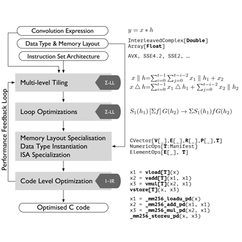

  

    
     
  

  

    

        <a href="./clover/">Clover: 4-bit Quantized Linear Algebra Library</a>  
        Clover is a new library for the efficient computation on low-precision data, providing mathematical routines required by fundamental methods in optimization and sparse recovery. Our library faithfully implements variants of stochastic quantization and supports 4-bit quantized format and demonstrate that 4-bit can be implemented efficiently using Intel AVX2 despite the lack of native support for this data format.

    

  

 

  

    
     
  

  

    

        <a href="./lms-intrinsics/">LMS Intrinsics</a>  
        A library that enables the use of SIMD x86 instructions in the Lightweight Modular Staging Framework (LMS).
        Implementation is done by Ivaylo Toskov as part of a master thesis project at the Department of Computer Science at ETH Zurich Switzerland, supervised by
        Markus Püschel and me.
    

  

 

  

    
  

  

    

        <a href="./fgen/">FGen: High-Performance Convolution Generator</a>  
        FGen is a program generator for performance-optimized functions implementing convolutions, or FIR filters. The generator uses an internal mathematical DSL to enable structural optimization at a high level of abstraction. We use FGen as a testbed to demonstrate how to provide modular and extensible support for modern SIMD (single instruction, multiple data) vector architectures in a DSL-based generator.
    

  

