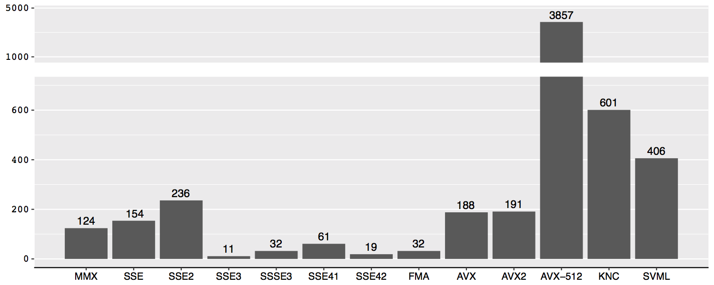
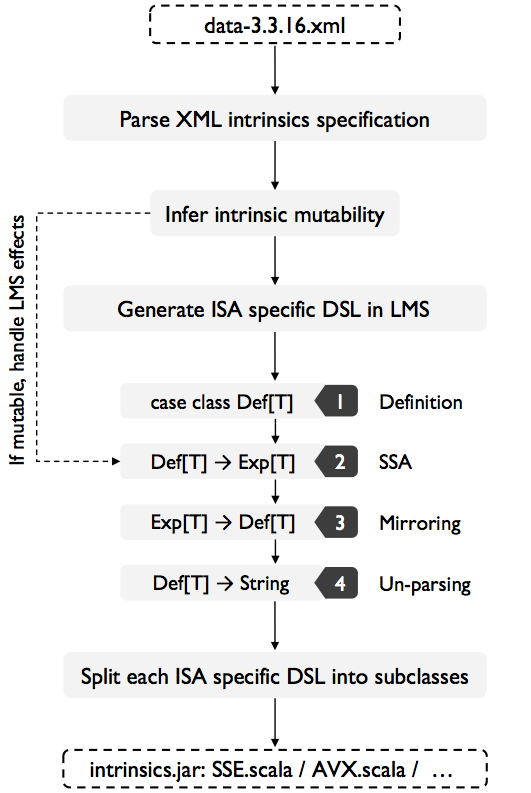
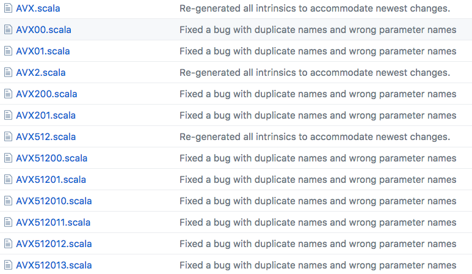

[lms-intrinsics](https://github.com/ivtoskov/lms-intrinsics) is a package that enables the use of SIMD x86 instructions
in the [Lightweight Modular Staging Framework (LMS)][lms]. While most SIMD
instruction are available as a low-level machine code, the lms-intrinsics
package focuses on the [C SIMD instrinsics][cintrinsics], which are supported by most
modern C compilers such as gcc, Intel Compiler, LLVM, etc, and provides
the appropriate generation of a vectorized C code.

<br />

Currently the following instruction sets (ISAs) are supported:
[MMX](https://en.wikipedia.org/wiki/MMX_(instruction_set)),
[SSE](https://en.wikipedia.org/wiki/Streaming_SIMD_Extensions),
[SSE2](https://en.wikipedia.org/wiki/SSE2),
[SSE3](https://en.wikipedia.org/wiki/SSE3),
[SSSE3](https://en.wikipedia.org/wiki/SSSE3),
[SSE4.1](https://en.wikipedia.org/wiki/SSE4#SSE4.1),
[SSE4.2](https://en.wikipedia.org/wiki/SSE4#SSE4.2),
[AVX](https://en.wikipedia.org/wiki/Advanced_Vector_Extensions),
[AVX2](https://en.wikipedia.org/wiki/Advanced_Vector_Extensions#Advanced_Vector_Extensions_2),
[AVX-512](https://en.wikipedia.org/wiki/Advanced_Vector_Extensions#AVX-512),
[FMA](https://en.wikipedia.org/wiki/FMA_instruction_set),
[KNC](http://openlab.web.cern.ch/sites/openlab.web.cern.ch/files/presentations/KNC_ISA_Overview_Apr2012_SJ_New_V4.pdf)
and [SVML](https://software.intel.com/en-us/node/524289).
Each SIMD intrinsic function is implemented as a construct of an
[Embedded Domain Specific Language (eDSL)](http://wiki.c2.com/?EmbeddedDomainSpecificLanguage)
in LMS. The intrinsics functions are then categorized according to their
ISA and are implemented in separate groups of SIMD eDSLs such that each
eDSL corresponds to a particular ISA.

<br />

This implementation of LMS Intrinsics is done by [Ivaylo Toskov](https://github.com/ivtoskov) as part of a master thesis project at the [Department of Computer Science](https://www.inf.ethz.ch/) at [ETH Zurich](https://www.ethz.ch/en.html) Switzerland, supervised by
[Markus Püschel](https://www.inf.ethz.ch/personal/markusp/) and me. This work has been published at [CGO'18](http://cgo.org/cgo2018/), obtaining all [4 badges of the conference](http://ctuning.org/ae/artifacts.html#cgo2018): Artifacts Available, Artifacts Functional, Results Replicated and Artifacts Reusable.

<br />

<div class="row">
    <div class="col-md-2">
        &nbsp;
    </div>
    <div class="col-md-2">
        
    </div>
    <div class="col-md-2">
        
    </div>
    <div class="col-md-2">
        
    </div>
    <div class="col-md-2">
        
    </div>
</div>

<br />

# Usage

[lms-intrinsics](https://github.com/ivtoskov/lms-intrinsics) is available on Maven and can be used through [SBT](http://www.scala-sbt.org/) including the following in `build.sbt`:

```scala
libraryDependencies += "ch.ethz.acl" %% "lms-intrinsics" % "0.0.5-SNAPSHOT"
```

A detailed explanation of the usage and a quick start tutorial can be found on the GitHub  &nbsp; <svg aria-hidden="true" class="octicon octicon-repo" height="12" version="1.1" viewBox="0 0 12 16" width="9"><path fill-rule="evenodd" d="M4 9H3V8h1v1zm0-3H3v1h1V6zm0-2H3v1h1V4zm0-2H3v1h1V2zm8-1v12c0 .55-.45 1-1 1H6v2l-1.5-1.5L3 16v-2H1c-.55 0-1-.45-1-1V1c0-.55.45-1 1-1h10c.55 0 1 .45 1 1zm-1 10H1v2h2v-1h3v1h5v-2zm0-10H2v9h9V1z"></path></svg> [repository](https://github.com/ivtoskov/lms-intrinsics).

<br />

Automatic Generation of SIMD eDSLs
======================================

There is a vast majority of SIMD instructions available in a given CPU. With the continuous development of the x86 architecture,
Intel has extended the instruction set architecture with many new sets, continuously adding more vector instructions. As a result
creating eDSLs aming to support majority of intrinsics functions, is not an easy challenge. The figure bellow gives an overview
of available intrinsics function for each instruction set architecture:

<br />
<div style="margin: auto; max-width: 650px">
        
</div>
<br />

As depicted on the image there are mote than 5000 functions that have to be ported into several eDSLs. Doing this manually is a
tedious and an error prone process. To avoid this, we decided to automate the generation of these SIMD eDSLs. A good place to
start is the [Intel Intrinsics Guide](https://software.intel.com/sites/landingpage/IntrinsicsGuide/) which provides the specifications
of each `C` intrinsic function. Observing this website, we noticed that it comes with a nice and convenient XML file that provides
the name, return type and input arguments of each intrinsic function:


```xml
<intrinsic rettype='__m256d' name='_mm256_add_pd'>
  <type>Floating Point</type>
  <CPUID>AVX</CPUID>
  <category>Arithmetic</category>
  <parameter varname='a' type='__m256d'/>
  <parameter varname='b' type='__m256d'/>
  <description>
    Add packed double-precision (64-bit)
    floating-point elements in "a" and "b",
    and store the results in "dst".
  </description>
  <operation>
    FOR j := 0 to 3
	  i := j*64
	  dst[i+63:i] := a[i+63:i] + b[i+63:i]
    ENDFOR
    dst[MAX:256] := 0
  </operation>
  <instruction name='vaddpd' form='ymm, ymm, ymm'/>
  <header>immintrin.h</header>
</intrinsic>

```

As a result, we wer able to create a generator that will take each XML entry and produce Scala code tailored for the LMS framework
that corresponds for each intrinsics functions:

<br />
<div style="margin: auto; max-width: 350px">
    
</div>
<br />

This process was quite convenient, as most intrinsics functions are in fact immutable and produce no effects. The generation is done
in 4 steps. Step 1: Generation of definitions:

```scala
case class MM256_ADD_PD (a: Exp[__m256d], b: Exp[__m256d]) extends IntrinsicDef[__m256d] {
  val category = List(IntrinsicsCategory.Arithmetic)
  val intrinsicType = List(IntrinsicsType.FloatingPoint)
  val performance = Map.empty[MicroArchType, Performance]
  val header = "immintrin.h"
}
```

Step 2: Automatic SSA conversion (driven by LMS)

```scala
def _mm256_add_ps(a: Exp[__m256], b: Exp[__m256]): Exp[__m256] = {
  MM256_ADD_PS(a, b)
}
```

Step 3: Mirroring (LMS default transformation step)

```scala
override def mirror[A:Typ](e: Def[A], f: Transformer)(implicit pos: SourceContext) = (e match {
  case MM256_ADD_PS (a, b) => _mm256_add_ps(f(a), f(b))
  // Pattern match against all other nodes
  case _ => super.emitNode(sym, rhs)
}
```


Step 4: Unparsing to `C`

```scala
override def emitNode(sym: Sym[Any], rhs: Def[Any]) = rhs match {
  case iDef@MM256_ADD_PS(a, b) =>
    headers += iDef.header
    emitValDef(sym, s"_mm256_add_ps(${quote(a)}, ${quote(b)})")
  // Pattern match against all other nodes
  case _ => super.emitNode(sym, rhs)
}
```

However, not all function are immutable, particularly load and store functions such as `_mm256_loadu_ps` or `_mm256_storeu_ps`. The Intel Intrinsics Guide however
includes parameter that depicts the category of each instruction. In fact it contains 24 categories, conveniently categorizing load and store instructions.
We were able to use this parameter to infer the intrinsic function mutability, and generate the proper LMS effects.

<br />

Another challenge was the limitations imposed by the JVM - the 64kB limit for a method. To avoid this issue, we develop the generator
such that generates Scala code that is split into several sub-classes, constituting a class that represent an ISA by inheriting each sub-class.

<br />
<div style="margin: auto; max-width: 600px">
    
</div>
<br />

The resulting Scala code is consisted of several Scala class files, that contain few thousands of lines of code that takes the Scala compiler several minutes to get
compiled. To make the future use of this work more convenient, we decided to precompile the library, and make it available at Maven.

<br />

To learn more about this work, check out our paper [SIMD Intrinsics on Managed Language Runtimes](/publications/preprint/004_cgo18-simd.pdf). For in-depth overview
of the process of automatic generation of SIMD eDSLs, have a look at the master thesis work of Ivaylo titled [Explicit SIMD instructions into JVM using LMS](https://www.research-collection.ethz.ch/handle/20.500.11850/166022).

[lms]: https://scala-lms.github.io/index.html
[cintrinsics]: https://en.wikipedia.org/wiki/Intrinsic_function#C_and_C++